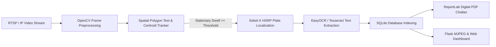

# 🚗 ParkGuard AI: Autonomous No-Parking Surveillance & HSRP Enforcement System

[](https://www.python.org/)
[](https://opencv.org/)
[](https://flask.palletsprojects.com/)
[](LICENSE)

**ParkGuard AI** is a production-grade, end-to-end Edge AI & Computer Vision infrastructure designed for continuous 24/7 monitoring of No-Parking zones, emergency corridors, and university campus gates. 

The system autonomously tracks vehicle stationary dwell time within user-drawn polygon ROIs, isolates High-Security Registration Plates (HSRP), extracts registration numbers via ALPR OCR, and generates legal digital PDF fine tickets (challans) in real time with zero manual intervention.

---

## 🌟 Key Features

- 🎯 **Interactive Canvas ROI Masking:** Draw custom No-Parking polygon zones directly on the video feed from the web dashboard.
- ⏱️ **Spatial-Temporal Dwell Tracking:** Eliminates false alarms by tracking exact stationary duration ($\Delta t$) before flagging violations.
- 🔤 **Indian HSRP ALPR OCR Engine:** Isolates embossed HSRP license plates using Sobel-X edge gradients, adaptive thresholding, and regex pattern matching (`[State][District][Series][Number]`).
- 🔊 **Real-time Alert Ticker & Audio Alarm:** Triggers instant audio alerts and flashing HUD notifications upon violation confirmation.
- 📄 **Automated Digital PDF Challan Generator:** Uses ReportLab to compile evidence snapshots, cropped plate photos, penalty details, and payment QR code placeholders into download-ready PDF tickets.
- 📹 **Multi-Source Video Input:** Supports RTSP streams, smartphone IP cameras (IP Webcam), laptop webcams, MP4 video files, and a built-in HSRP traffic simulator for offline presentations.

---

## 🏗️ System Architecture



---

## 🛠️ Tech Stack

| Domain | Frameworks & Libraries |
| :--- | :--- |
| **Computer Vision & Logic** | Python 3.10+, OpenCV, NumPy, NMS (Non-Maximum Suppression) |
| **ALPR & OCR** | EasyOCR, PyTesseract, Regex Parsing |
| **Backend Server** | Flask REST API, Multithreaded MJPEG Video Streamer |
| **Database** | SQLite Relational Database |
| **PDF Generation** | ReportLab PDF Graphics Engine |
| **Web UI** | HTML5, Vanilla CSS3 (Glassmorphism), JavaScript (ES6+), Canvas API |

---

## 🚀 Quick Start & Installation

### 1. Clone the Repository
```bash
git clone https://github.com/Aryan1238/ParkGuard-AI.git
cd ParkGuard-AI
```

### 2. Set Up Virtual Environment
```bash
python3 -m venv venv
source venv/bin/activate  # On Windows: venv\Scripts\activate
```

### 3. Install Dependencies
```bash
pip install -r requirements.txt
```

### 4. Run the Application
```bash
python app.py
```

Open your browser and navigate to:  
👉 **`http://localhost:5050`**

---

## 🖥️ Usage Instructions

1. **Traffic Demo Mode:** Click **`Traffic Demo`** to test the system with dynamic animated vehicles and HSRP plate detection.
2. **Connect Smartphone Camera:**
   - Install **IP Webcam** on Android/iOS.
   - Click **`Connect Phone Camera`** in the dashboard and enter: `http://<YOUR_PHONE_IP>:8080/video`.
3. **Draw Custom No-Parking Zone:** Click **`Draw No-Parking Zone`**, click on 4 or more points on the video stream, and press **`Save Zone`**.
4. **Download PDF Challans:** View active violations in the table below and click **`PDF`** to download legal fine receipts.

---

## 📄 License

Distributed under the **MIT License**. See `LICENSE` for details.
